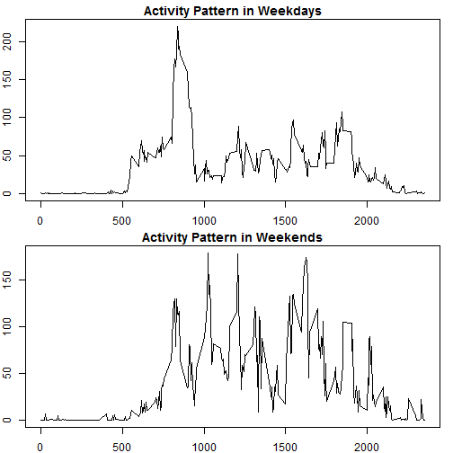

# Reproducible Research: Peer Assessment 1


## Loading and preprocessing the data
### First we are going to check if the file exists. If it doesn't we proceed to charge it from the web.


```r
if(!file.exists("./activity.csv/")){
    if(!file.exists("./activity.zip")){
        fileUrl <- "https://github/jmaa46/RepData_PeerAssessment/activity.zip" 
        download.file(fileUrl, destfile = "./activity.zip")
        unlink(fileUrl)
    }
}
```

### Check if the file is in a readable form or it is compressed, if it is the case proceed to unzip it.
  


```r
if(!file.exists("./activity.csv")) {
    activity.csv <- unzip("./activity.zip")
}  
dataActivity <- read.csv("./activity.csv")
str(dataActivity)
```

```
## 'data.frame':	17568 obs. of  3 variables:
##  $ steps   : int  NA NA NA NA NA NA NA NA NA NA ...
##  $ date    : Factor w/ 61 levels "2012-10-01","2012-10-02",..: 1 1 1 1 1 1 1 1 1 1 ...
##  $ interval: int  0 5 10 15 20 25 30 35 40 45 ...
```

```r
head(dataActivity)
```

```
##   steps       date interval
## 1    NA 2012-10-01        0
## 2    NA 2012-10-01        5
## 3    NA 2012-10-01       10
## 4    NA 2012-10-01       15
## 5    NA 2012-10-01       20
## 6    NA 2012-10-01       25
```

## What is mean total number of steps taken per day?
### Calculate the sum of steps by day and calculate the mean and  the median.


```r
sumSteps <- tapply(dataActivity$steps,dataActivity$date,sum)
hist(sumSteps,col= "red",xlab="Steps by day",main="Steps by day")
```

 

```r
Mean <- mean(sumSteps, na.rm = TRUE)
Median <- median(sumSteps, na.rm = TRUE)
"Mean ="; Mean
```

[1] "Mean ="
[1] 10766

```r
"Median ="; Median
```

[1] "Median ="
[1] 10765

## What is the average daily activity pattern?
### Convert the intervals as factor and calculate the mean by interval, excluding the missing
### values. for plotting we take the levels of the factor for the x-axis. We calculate which interval has the maximum value for the mean of steps and for the total steps, and report both.


```r
facInter <- as.factor(dataActivity$interval)
str(facInter)
```

 Factor w/ 288 levels "0","5","10","15",..: 1 2 3 4 5 6 7 8 9 10 ...

```r
meanSteps <- tapply(dataActivity$steps,facInter,mean,na.rm=TRUE)
Intervals <- levels(facInter)
plot(Intervals,meanSteps,type="l", main = "Daily Activity Pattern")
```

 

```r
maxInter <- which.max(meanSteps)
meanSteps[maxInter]
```

  835 
206.2 

```r
"Interval with the maximun mean value of steps ="; maxInter
```

[1] "Interval with the maximun mean value of steps ="
835 
104 

```r
"Maximun Mean Value ="; meanSteps[maxInter]
```

[1] "Maximun Mean Value ="
  835 
206.2 

```r
ssumSteps <- tapply(dataActivity$steps,facInter,sum,na.rm=TRUE)
maxsumSteps <- which.max(ssumSteps)
ssumSteps[maxsumSteps]
```

  835 
10927 

```r
"Interval with the maximun value of steps =";maxsumSteps
```

[1] "Interval with the maximun value of steps ="
835 
104 

```r
"Maximum Number of steps =";ssumSteps[maxsumSteps]
```

[1] "Maximum Number of steps ="
  835 
10927 

## Imputing missing values
### First, calculate how many missing values are there. Second, create a copy of the data to include a value in the correspondig 5 minute interval with the NA. Third,filling the NA's with the mean value of the 5 minute interval. Proceed to sum the steps by day and do the plot and calculate the mean and the median. The results are identical with those worked with de NA's.


```r
missingValues <- is.na(dataActivity$steps)
sum(missingValues)
```

[1] 2304

```r
"Missing Values ="; sum(missingValues)
```

[1] "Missing Values ="
[1] 2304

```r
dataActivityM <- dataActivity
for(i in 1:length(missingValues)) {
    if(missingValues[i]){
        inter <- dataActivityM$interval[i] ; inter <- as.character(inter)
        dataActivityM$steps[i] <- meanSteps[inter]
    }  
}
sumStepsM <- tapply(dataActivityM$steps,dataActivityM$date,sum)
hist(sumStepsM,col= "blue",xlab="Steps by day",main="Steps by day filling missing values")
```

 

```r
"Mean with missing values filled ="; mean(sumStepsM)
```

[1] "Mean with missing values filled ="
[1] 10766

```r
"Median with missing values filled ="; median(sumStepsM)
```

[1] "Median with missing values filled ="
[1] 10766

## Are there differences in activity patterns between weekdays and weekends?
### First, convert the column $date as a Date and find the day of the week they are. Second, include a new column with values ("weekend day", "week day"). Third, divide the file in two ones, dataWeek and dataWeekend. Fourth, proceed to construct the plots. It is observed two different patterns: the weekdays have a maximum at 835 and the rest of the day is more camly, the weekends the pattern is more erratic and suggests a wake up later and more activities the rest of the day.


```r
wdays <- weekdays(as.Date(dataActivityM$date))
for(i in 1:length(wdays)) {
  if(wdays[i] == "sabado" | wdays[i] == "domingo"){
    dataActivityM$wdays[i] <- "weekend day" 
  } else {
    dataActivityM$wdays[i] <- "weekday"
  }
}  
monfri <- dataActivityM$wdays=="weekday"
dataWeek <- dataActivityM[monfri,]
dataWeekend <- dataActivityM[!monfri,]
dataWeek$interval <- as.factor(dataWeek$interval)
dataWeekend$interval <- as.factor(dataWeekend$interval)
meanWeek <- tapply(dataWeek$steps,dataWeek$interval,mean)
meanWeekend <- tapply(dataWeekend$steps,dataWeekend$interval,mean)
```

### Plot the Activities


```r
par(mfrow = c(2,1))
par(mar=c(2,2,1.5,1)) 
plot(Intervals,meanWeek,type = "l",main= "Activity Pattern in Weekdays")
plot(Intervals,meanWeekend,type = "l",main="Activity Pattern in Weekends")
```

 


